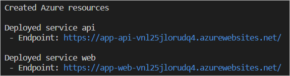

# ToDo Application with a Node.js API and Azure Cosmos DB API for MongoDB on Azure App Service

A complete ToDo application that includes everything we had build, deploy, and monitor an Azure solution. This application uses the Azure Developer CLI (azd) to get  up and running on Azure quickly using Bicep as the IaC provider, React.js for the Web application, Node.js for the API, Azure Cosmos DB API for MongoDB for storage, and Azure Monitor for monitoring and logging. It includes application code, tools, and pipelines that serve as a foundation from which we can build upon and customize when creating our own solutions.


<sup>Screenshot of the deployed ToDo app</sup>

### Prerequisites

The following prerequisites are required to use this application. Please ensure that we have them all installed locally.

- [Azure Developer CLI](https://aka.ms/azd-install)
- [Node.js with npm (16.13.1+)](https://nodejs.org/) - for API backend and Web frontend


### how to run
1. Run the following command to initialize the project, provision Azure resources, and deploy the application code.

```bash
azd up --template todo-nodejs-mongo
```


- `Environment Name`: This will be used as a prefix for the resource group that will be created to hold all Azure resources. This name should be unique within 
Azure subscription.


- `Azure Location`: The Azure location where our resources will be deployed.
- `Azure Subscription`: The Azure Subscription where our resources will be dployed.


> NOTE: This may take a while to complete as it executes three commands: `azd init` (initializes environment), `azd provision` (provisions Azure resources), and `azd deploy` (deploys application code). we will see a progress indicator as it provisions and deploys our application.


When `azd up` is complete it will output the following URLs:

- Azure Portal link to view resources
- ToDo Web application frontend
- ToDo API application



Click the web application URL to launch the ToDo app. Create a new collection and add some items. This will create monitoring activity in the application that we will be able to see later when we run `azd monitor`.

### Application Architecture

This application utilizes the following Azure resources:

- [**Azure App Services**](https://docs.microsoft.com/azure/app-service/) to host the Web frontend and API backend


- [**Azure Cosmos DB API for MongoDB**](https://docs.microsoft.com/azure/cosmos-db/mongodb/mongodb-introduction) for storage

- [**Azure Monitor**](https://docs.microsoft.com/azure/azure-monitor/) for monitoring and logging

- [**Azure App Insight**](https://portal.azure.com/#view/HubsExtension/BrowseResource/resourceType/microsoft.insights%2Fcomponents) for app log trail and insight

- [**Azure Key Vault**](https://docs.microsoft.com/azure/key-vault/) for securing secrets


Here's a high level architecture diagram that illustrates these components. Notice that these are all contained within a single [resource group](https://docs.microsoft.com/azure/azure-resource-manager/management/manage-resource-groups-portal), that will be created for we when we create the resources.


> This template provisions resources to an Azure subscription that we will select upon provisioning them. Please refer to the [Pricing calculator for Microsoft Azure](https://azure.microsoft.com/pricing/calculator/) and, if needed, update the included Azure resource definitions found in `infra/main.bicep` to suit our needs.
### Bicep For Infrastructure as Code (IaC) 
Bicep is a language for declarative deployment of Azure resources. You can use Bicep instead of JSON to develop your Azure Resource Manager models (ARM models).


### Application Code


- **Source Code**: All application source code is located in the `src` folder.
- **Infrastructure as Code**: All application "infrastructure as code" files are located in the `infra` folder.
- **Azure Developer Configuration**: An `azure.yaml` file located in the root that ties the application source code to the Azure services defined in our "infrastructure as code" files.
- **GitHub Actions**: A sample GitHub action file is located in the `.github/workflows` folder.
- **VS Code Configuration**: All VS Code configuration to run and debug the application is located in the `.vscode` folder.


### Pipeline and devops

At this point, we have a complete application deployed on Azure. But there is much more that the Azure Developer CLI can do. These next steps will introduce we have additional commands that will make creating applications on Azure much easier. Using the Azure Developer CLI, we can setup our pipelines, monitor our application, test and debug locally.

#### Set up a pipeline using `azd pipeline`

This template includes a GitHub Actions pipeline configuration file that will deploy our application whenever code is pushed to the main branch. we can find that pipeline file here: `.github/workflows`.

Setting up this pipeline requires us to give GitHub permission to deploy to Azure on our behalf, which is done via a Service Principal stored in a GitHub secret named `AZURE_CREDENTIALS`. The `azd pipeline config` command will automatically create a service principal for we.


```bash
azd pipeline config
```

#### Monitor the application using `azd monitor`

To help with monitoring applications, the Azure Dev CLI provides a `monitor` command to help we get to the various Application Insights dashboards.

- Run the following command to open the "Overview" dashboard:

  ```bash
  azd monitor --overview
  ```

- Live Metrics Dashboard

  Run the following command to open the "Live Metrics" dashboard:

  ```bash
  azd monitor --live
  ```

- Logs Dashboard

  Run the following command to open the "Logs" dashboard:

  ```bash
  azd monitor --logs
  ```

#### Run and Debug Locally

The easiest way to run and debug is to leverage the Azure Developer CLI Visual Studio Code Extension. Refer to this [walk-through](https://aka.ms/azure-dev/vscode) for more details.

#### Clean up resources

When we are done, we can delete all the Azure resources created with this template by running the following command:

```bash
azd down
```
